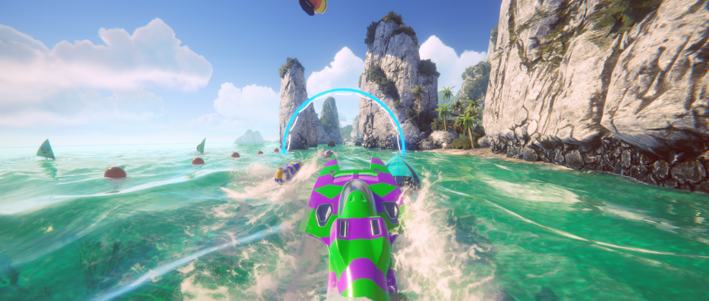
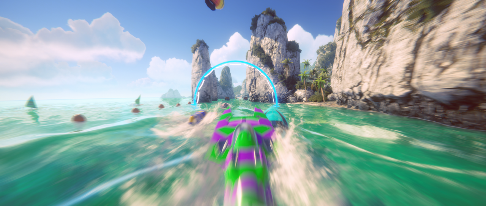

# 运动模糊（Motion Blur）

  
_未启用 Motion Blur 效果的场景。_

  
_启用 Motion Blur 效果的场景。_

**Motion Blur** 效果模拟了现实世界中相机在拍摄运动速度超过曝光时间的物体时产生的模糊。这通常发生在快速移动的物体或长曝光时间的情况下。

## 使用 Motion Blur

**Motion Blur** 使用 [Volume](Volumes.md) 系统，因此要启用和修改 **Motion Blur** 的属性，必须在场景中的 [Volume](Volumes.md) 组件中添加 **Motion Blur** 覆盖。

### 在 Volume 中添加 Motion Blur：

1. 在 **Scene** 视图或 **Hierarchy** 视图中，选择包含 Volume 组件的 GameObject，以在 Inspector 中查看。
2. 在 **Inspector** 窗口中，点击 **Add Override > Post-processing**，然后选择 **Motion Blur**。  
   **Universal Render Pipeline** 会将 **Motion Blur** 应用于该 Volume 影响的所有相机。

## 属性

| **属性** | **描述** |
| --- | --- |
| **Mode** | 选择运动模糊技术。   选项：   <ul><li> **Camera Only**：仅使用相机的运动来模糊对象。此技术不使用运动矢量。相比 **Camera and Objects**，该技术具有更好的性能。</li><li> **Camera and Objects**：使用相机和游戏对象的运动。游戏对象的运动矢量会覆盖相机的运动矢量。 </li></ul> |
| **Quality** | 设置效果的质量。较低的预设提供更好的性能，但视觉质量较低，并且可能会出现更多的视觉伪影。 |
| **Intensity** | 将运动模糊滤镜的强度设置为 0 到 1 之间的值。较高的值会产生更强的模糊效果，但可能会因 **Clamp** 参数而导致性能下降。 |
| **Clamp** | 设置由于相机旋转而产生的速度的最大长度。此参数限制了高速运动下的模糊效果，以避免过高的性能开销。该值以屏幕完整分辨率的比例测量，取值范围为 0 到 0.2。较低的值消耗更少的资源，并能提升性能。   默认值为 0.05。 |