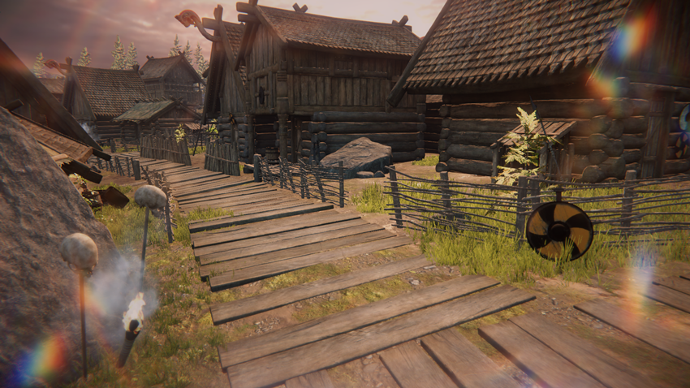
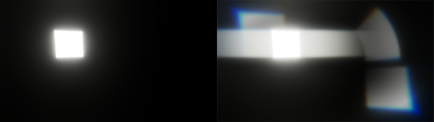

屏幕空间镜头光晕
===================================

启用屏幕空间镜头光晕的场景。

**Screen Space Lens Flare** 覆盖效果可为 **scene** 添加镜头光晕。

为了计算镜头光晕，URP 提取当前图像中的亮区，例如自发光表面和高光反射区域。URP 然后在屏幕上的不同位置绘制这些亮区，并应用拉伸、模糊、色差等不同的效果。

**Screen Space Lens Flare** 可从以下来源创建镜头光晕：

*   自发光表面。
*   **camera** 视角下的亮点，例如金属物体上的明亮高光反射，或从黑暗的室内区域观察明亮的户外区域。
*   所有屏幕上的光源。

你也可以使用 [Lens Flare (SRP)](../shared/lens-flare/lens-flare-component.md) 组件来为场景中特定位置的光源创建光晕。你还可以在同一场景中同时使用 **Lens Flare (SRP)** 组件和 **Screen Space Lens Flare** 覆盖效果。

屏幕空间镜头光晕是如何工作的？
---------------------------------

URP 用于计算屏幕空间镜头光晕的亮区与 [Bloom 覆盖效果](../post-processing-bloom.md) 增亮的区域相同。

URP 使用与 Bloom 覆盖效果相同的缓冲区来获取亮区并渲染镜头光晕。因此，Bloom 覆盖效果的设置会影响屏幕空间镜头光晕的外观。

**注意：** 如果体积中存在 [Bloom 覆盖效果](../post-processing-bloom.md)，则需要将 **Intensity** 设置为大于 0，否则镜头光晕不会出现。

你可以创建以下类型的镜头光晕：

*   **常规光晕（Regular flares）**：亮区的扭曲增亮版本。
*   **反向光晕（Reversed flares）**：常规光晕的上下翻转和镜像版本。
*   **扭曲光晕（Halo flares）**：使用极坐标变换常规光晕，以模拟圆形相机镜头。
*   **条纹（Glare）**：沿特定方向拉伸的光晕，以模拟变形宽屏镜头。

你可以控制出现的光晕类型及数量，同时也可以调整 URP 应用于光晕的色差效果。

左侧图像显示了仅应用 Bloom 而未启用镜头光晕的自发光立方体。右侧图像显示了相同的立方体，并包含常规光晕（左上）、反向光晕（右下）、扭曲光晕（右上）以及条纹（立方体左右两侧）。

**注意：** 某些镜头光晕仅在启用 **HDR** 时出现，或以完全强度显示。要启用 **HDR**，请参阅 [Camera 组件参考的 **Output** 部分](../camera-component-reference.md#Output)。
