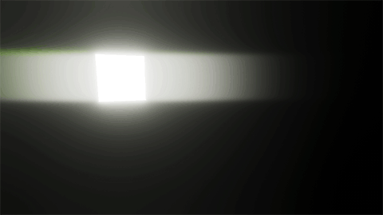

用于 URP 的屏幕空间镜头光晕覆盖参考
==================================================

有关更多信息，请参阅 [添加屏幕空间镜头光晕](post-processing-screen-space-lens-flare.md)。

Properties
----------

| **属性** | **描述** |
| --- | --- |
| **Intensity** | 设置所有类型的 **lens flares** 的强度。如果值为 0，URP 不会计算或渲染任何镜头光晕。默认值为 0。 |
| **Tint Color** | 设置 URP 用于所有类型镜头光晕的着色颜色。默认值为白色。 |
| **Bloom Mip Bias** | 设置 URP 采样 Bloom 金字塔并生成镜头光晕的 mipmap 级别。mipmap 级别越高，采样源越小且像素化越严重，最终效果越模糊。范围为 1 到 5，其中 1 代表半分辨率 mipmap 级别。默认值为 1。有关更多信息，请参阅 [Mipmaps introduction](https://docs.unity.cn/cn/tuanjiemanual/Manual/texture-mipmaps-introduction.html)。|

### Ghost

使用 **Ghost** 设置来控制常规光晕、反向光晕和扭曲光晕。

| **属性** | **描述** |
| --- | --- |
| **Regular Multiplier** | 设置常规光晕的强度。如果值为 0，URP 不会计算或渲染常规光晕。默认值为 1。 |
| **Reversed Multiplier** | 设置反向光晕的强度。如果值为 0，URP 不会计算或渲染反向光晕。默认值为 1。 |
| **Halo Multiplier** | 设置扭曲光晕的强度。如果值为 0，URP 不会计算或渲染扭曲光晕。默认值为 1。 |
| **Halo Scale** | 调整扭曲光晕的宽度（**x**）和高度（**y**）。默认值为 (1,1)。 宽度（**x**）和高度（**y**）取值相同时，会产生圆形的扭曲光晕。  此属性仅在打开 **More** (⋮) 菜单并选择 **Show Additional Properties** 时可见。 |
| **Samples** | 设置 URP 重复计算常规、反向和扭曲光晕的次数。范围为 1 到 3。默认值为 1。增加 **Samples** 会显著影响性能。 |
| **Sample Dimmer** | 设置当 **Samples** 设为 2 或 3 时，URP 额外添加的镜头光晕的强度。值越高，光晕越不明显。此属性仅在打开 **More** (⋮) 菜单并选择 **Show Additional Properties** 时可见。 |
| **Starting Position** | 控制第一个常规、反向和扭曲光晕与其采样的亮区之间的距离。如果值为 1，URP 会将镜头光晕放置在与采样亮区相同的位置。范围为 0 到 2。默认值为 1.25。 |
| **Ghost Scale** | 设置各个常规、反向和扭曲镜头光晕的之间的距离与大小。 默认值为 1。 |
| **Vignette Intensity** | 在屏幕中央的圆形区域内控制常规、反向和扭曲光晕的强度。使用 **Vignette Intensity** 避免镜头光晕过度遮挡 **scene**。默认值为 1，表示 URP 不会在屏幕中心渲染光晕。 |
| **Vignette Scale** | 控制**Vignette Intensity**影响的范围。 默认值为(1, 1)。   此属性仅在打开 **More** (⋮) 菜单并选择 **Show Additional Properties** 时可见。 |

### Glare

使用 **Glare** 设置控制沿某一方向拉伸的光晕。

| **属性** | **描述** |
| --- | --- |
| **Glare Multiplier** | 设置条纹光晕的强度。如果值为 0，URP 不会计算或渲染条纹光晕。默认值为 0。 |
| **Length** | 设置条纹光晕的长度。范围为 0 到 1。取值1 约等于屏幕宽度。默认值为 0.5。 |
| **Orientation** | 设置条纹光晕的角度（单位：度°）。 范围为0°到180°。 默认值为 0°，即创建水平条纹光晕。 |
| **Glare Threshold** | 控制条纹光晕的局部化程度。值越高，效果越局限于亮区。范围为 0 到 1。默认值为 0.5。 |
| **Resolution** | 控制条纹光晕的分辨率细节。URP 渲染低分辨率条纹光晕的速度更快。可选项为 **Half**、**Quarter** 和 **Eighth** 全分辨率。 此属性仅在打开 **More** (⋮) 菜单并选择 **Show Additional Properties** 时可见。 |

  

### 色差 Chromatic Aberration

使用 **Chromatic Aberration** 设置控制所有镜头光晕类型的色差。色差会将光线拆分为其颜色分量，模拟现实世界 **camera** 的效果，即镜头无法将所有颜色聚焦到同一点上。

色差效果在屏幕边缘最强，并在靠近屏幕中心时逐渐减弱。

| **属性** | **描述** |
| --- | --- |
| **Intensity** | 设置色差效果的强度。如果值为 0，URP 不会拆分颜色。 默认值为0.5。|
